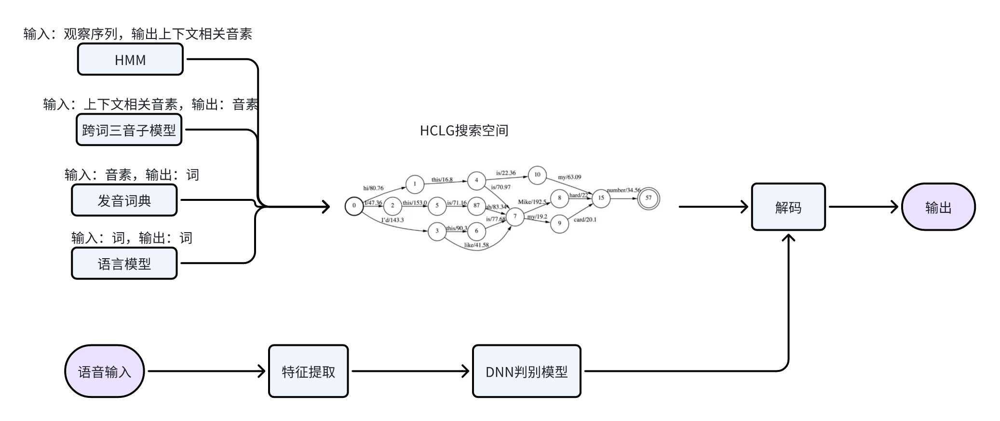
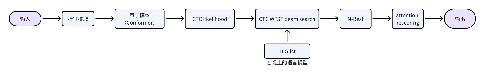

# 【语音识别】手撕ngram语言模型（原理篇）

## 背景介绍
语音识别系统将语音信号转换为文本序列，HMM-DNN时代，语音识别框架有三个重要的组件：
- HMM-DNN声学模型
- 语言模型（ngram）
- 基于WFST的BeamSearch解码算法
目前主流的端到端网络中，仍然离不开语言模型+WFST解码技术，尤其在实际生产环境中，该技术是解决特定badcase的有效手段。下图分别是：传统asr和端到端asr的流程图

<center>
    
</center>

<center>
    
</center>

### 为什么需要语言模型？
语言模型在语音识别整个流程中的作用抽象来讲是根据某一或多个领域的语言表达习惯给解码空间引入只是约束，限制解码搜索空间的大小，以便在合理的计算时间内得到有意义的文字序列。

### 为什么语言模型会限制解码搜索空间大小，加快语音识别解码速度呢？
假设在一个小语言语言系统中只有“我\爱\中国”3个词语，如果没有任何的语言表达习惯限制，那这3个词语一共可以构成 $\sum_{n=0}^{N} 3^n$  种表达, 其中N是一句话的词数。假设强制说话时候每句话字数不超过20，将会产生5230176601种语言表达。如果要对这个语言进行语音识别，解码时仅考虑词语序列的不同组合就有5230176601个路径待搜索。而现实中，高级文明的文字符号有成千上万个，不加任何限制的语言表达可能接近无穷，解码器根本不可能在有限时间内得到识别结果。

如果加入了语言模型的信息，就会剔除那些不符合语言表达习惯的路径，限制搜索空间的大小，使得解码时间可接受。如此，语音识别技术才可进入商用产品的视角中。

> **本文主要介绍ngram语言模型的基础知识，并手撕计算一个ngram模型。WFST的解码算法在后续的文章中更新。**

## ngram理论知识
### 算法原理
在语音识别技术出现早期，研究人员用各式各样的模板来表示语言表达习惯，但人类的语言是不断发展的，新的词汇和句式一直在出现。比如一些网络热词：尊嘟假嘟、绝绝子等。
因此衍生出一些问题：
- 如何能不断更换句法模板，跟上语言变化的节奏？
- 新句式的文本是很容易获取到，能否通过这些文本数据自动学习句法规则呢？

答案是肯定的，统计语言模型应运而生，ngram是其中代表性的技术，也是目前主流的方法。

统计语言模型通过概率P（词序列）来衡量这个词序列与语言表达习惯的符合程度，P（词序列）越低，表示在解码过程中代表这个词序列的搜索路径越应该被舍弃。计算公式如下：
$$\begin{aligned}
&\begin{aligned}
& P\left(\text { 词序列 } \text { word }_1 \text { word }_2 \ldots \text { word }_N\right)=P\left(\text { word }_1\right) P\left(\text { word }_2 \mid \text { word }_1\right) ... P\left(\text { word }_N \mid \text { word }_1 \text { word }_2 \ldots \text { word }_{N-1}\right) \\
& =\prod^N P\left(\text { word }_n \mid \text { word }_1^{n-1}\right) \quad \text { word }_1^{n-1} \text { 代表word } d_1 \text { word }_2 \ldots \text { word }_{n-1}
\end{aligned}\\
\end{aligned}$$
以 $context_n$表示 $word_n$ 的历史信息 $word_1^{n-1}$ , 如果不对$context_n$的长度加以限制的话，$P(word_n | context_n)$，根本无法估计。

为了解决这个问题，对上面的概率公式引入$n-1$阶马尔可夫假设：假设$word_i$的出现概率只依赖于部分历史信息，于其他任何信息是相互独立的。这就是ngram语言模型的原理。修改后的公式如下：
$$\begin{aligned}
P\left(\text { 词序列 } \text { oord }_1 \text { word }_2 \ldots \text { word }_N\right)= & \prod^N P\left(\text { word }_i \mid \text { word }_{i-n+1}^{i-1}\right) \\
& \text { word }_{i-n+1}^{i-1} \text { 代表 } \text { word }_{i-n+1} . \text { word }_{i-n+1} ... \text { word }_{i-1}
\end{aligned}$$

常情况下n=1,2,3。对于再高阶的4-gram，5-gram就很少见，因为需要非常大的语料才能训练充分高阶的语言模型，而且模型本身的体积也会非常大（占内存）。
- 当n=1时为unigram：当前词的概率分布与历史信息无关
- 当n=2时为bigram：当前词的概率分布只和前一个词有关
- 当n=3时为trigram：当前词的概率分布只和前两个词有关


### 数据平滑
ngram概率计算一般由训练语料的最大似然估计得到，以3-gram为例：
$$P(\text { 词 } 3 \mid \text { 词 } 1 \text { 词 } 2)=\frac{\operatorname{count}(\text { 词 } 1 \text { 词 } 2 \text { 词 } 3)}{\operatorname{count}(\text { 词 } 1 \text { 词 } 2)}$$
如果句式(词1词2词3)在训练语料中从未出现过，而现实中其实是有这种表达形式存在的。怎么估算这个3gram的概率
答案是, 将训练语料中出现过的句式的概率拿出一部分分配给未出现过。一般会采用两种方式处理：
- "人人平等", 将所有的句式都加上一定数量的count，例如：additive平滑
- "劫富济贫", 将训练语料中出现频繁的句式的count拿出一部分，给count=0的句式。例如：good-turing平滑
数据平滑的目的有两个：一个是使所有的N-gram概率之和为1，使所有的n-gram概率都不为0。它的本质，是重新分配整个概率空间，使已经出现过的n-gram的概率降低，补充给未曾出现过的n-gram。

上述平滑方式得到的模型表现通常不太好，因为它们对所有未在训练语料中出现过的句式“一视同仁”，分配相同的概率，比如：如果在训练预料中“学习 语音” “学习 余音”count都是0，那么最终得到一样的概率。但直觉上，前者应该被分配更高的概率。解决这个问题的方式是引入低阶grammar信息，重新分配概率。即：插值和回退。

- 线性插值平滑（Interpolation smoothing）基本思想就是利用低元N-grams模型对高元N-grams模型进行线性插值。

$$\begin{gathered}
P_{\mathrm{Int}}\left(w_i \mid w_{i-1}, w_{i-2}\right)=\lambda_3 P_{\mathrm{MLE}}\left(w_i \mid w_{i-1}, w_{i-2}\right)+\lambda_2 P_{\mathrm{MLE}}\left(w_i \mid w_{i-1}\right)+\lambda_1 P_{\mathrm{MLE}}\left(w_i\right) \\
\lambda_3+\lambda_2+\lambda_1=1, \quad 0 \leq \lambda_i \leq 1
\end{gathered}$$

- 回退算法（Katz smoothing）又称为 Back-off 回退。当有足够计数时，使用N元语法；否则使用 $N-1 ， N-2 ， \ldots$ ， bigrams, unigrams。

$$P_{\text {Katz }}= \begin{cases}d_{w_{i-n+1} \cdots w_i} \frac{C\left(w_{i-n+1} \cdots w_i\right)}{C\left(w_{i-n+1} \cdots w_{i-1}\right)}, & \text { if } C\left(w_{i-n+1} \ldots w_i\right)>k \\ \alpha_{w_{i-n+1} \cdots w_i} P_{\text {Katz }}\left(w_i \mid w_{i-n+2} \ldots w_{i-1}\right) & \text { else }\end{cases}$$

其中 $\alpha$ 和 $d$ 为归一化参数，保证 $\sum P_{\mathrm{Katz}}=1$ 。 $k$ 一般选择为 0 ，也可以选其它的值。

**插值和回退最大的区别在于**count>0的这部分grammar概率处理：插值为这部分grammar融入了低阶信息，而回退不会融入低阶信息，直接取最大似然估计得出概率。

插值和回退技术通常和additive平滑或者goog-turing平滑共同使用。

> 平滑算法有多个,例如:witten-bell、jelinek-mercer-interpolate、katz backoff、Kneser-Ney Smoothing等。目前通常情况下(不考虑prune得很极致的情况)，性能最优的是改进的Kneser-Ney Smoothing算法。

### 模型评估
训练一个ngram语言模型，如何衡量它对语言表达习惯约束的准确性呢？
有一个直观的思路是：给定一个高质量的句子，好的模型生成这个句子的概率会比较高。于是有研究人员顺着这条思路提出了困惑度。
困惑度（Perplexity）是一种衡量语言模型预测样本的好坏的指标，常用于自然语言处理中。
$$\begin{aligned}
&\text { 交叉嫡 } H(\operatorname{corpus} D)=\frac{1}{N} \sum_{i=1}^N-\frac{N_w}{N_D} \log _2(P(\text { 第 } i \text { 个句子 } \mid n g r a m \text { 语言模型 }))\\
&\text { 混淆度 } p p l(\text { corpusD })=2^{H(\text corpusD) } \quad p p l \text { 越大, ngram模型质量越差 }
\end{aligned}$$
在理想情况下，如果模型对每个单词的预测都是完美的，则困惑度为 1。通常情况下，困惑度会大于 1，困惑度值越小表示模型预测能力越好。


### 手把手计算ngram语言模型
以下语料作为训练语料，手撕一个bigram语言模型
```
中国
爱 中国
我
爱
中国
```
### 1. 初始统计
第一步是进行ngram的统计，因为这里训练bigram的语言模型，所以需要统计unigram以及bigram的数量。
在进行统计之前需要先给语料中每句话的开始和结束加上特殊的token：`<s>` 和 `</s>`。这样语料进一步处理成：
```
<s> 中国 </s>
<s> 爱 中国 </s>
<s> 我 </s>
<s> 爱 </s>
<s> 中国 </s>
```
根据以上语料统计ngram的数量:

| unigram     | count |
| ----------- | ----- |
| `<s>`       | 5     |
| 我          | 1     |
| 爱          | 2     |
| 中国        | 3     |
| `</s>`      | 5     |
|             |       |
| bigram      | count |
| `<s>` 中国  | 2     |
| `<s>` 爱    | 2     |
| `<s>` 我    | 1     |
| 爱 中国     | 1     |
| 中国 `</s>` | 3     |
| 我 `</s>`   | 1     |
| 爱 `</s>`   | 1     |

### 2. 计数调整
对于N-gram的语言模型，调整计数主要针对`n<N`的ngram进行计数调整。主要思想是对于lower-gram，不关心其出现的次数，而关心其作为连接词的可能性，因此核心是将计数从原先的直接数量统计调整为可接词数量的统计。具体的计算方法如下：
$$a\left(w_1^n\right)= \begin{cases}c\left(w_1^n\right) & n=N \quad \text { or } \quad w_1=<s> \\ \left|v: c\left(v: w_1^n\right)>0\right| & \text { otherwise }\end{cases}$$

这里的 $c\left(w_1^n\right)$ 表明对于 $w_1^n$ 语料中的直接计数， $a\left(w_1^n\right)$ 表明调整后的计数。当 $\mathrm{n}=\mathrm{N}$ 或者 $w_1$ 为 $\langle s\rangle$ 时不需要调整计数；对于其他情况，需要将计数调整为 $w_1^n$ 之前可接词的数量。

| unigram     | adjust count | reason                                               |
| ----------- | ------------ | ---------------------------------------------------- |
| `<s>`       | 5            | w1 = `<s>`, a = c = 5                                |
| 我          | 1            | \| {`<s>`, 我} \| = 1                                |
| 爱          | 1            | \| {`<s>`, 爱} \| = 1                                |
| 中国        | 2            | \| {`<s>`, 中国}, {爱, 中国} \| = 2                  |
| `</s>`      | 3            | \| {中国, `</s>`}, {我, `</s>`}, {爱, `</s>`} \| = 3 |
|             |              |                                                      |
| bigram      | adjust count | reason                                               |
| `<s>` 中国  | 2            | n = N, a = c =2                                      |
| `<s>` 爱    | 2            | n = N, a = c =2                                      |
| `<s>` 我    | 1            | n = N, a = c =1                                      |
| 爱 中国     | 1            | n = N, a = c =1                                      |
| 中国 `</s>` | 3            | n = N, a = c =3                                      |
| 我 `</s>`   | 1            | n = N, a = c =1                                      |
| 爱 `</s>`   | 1            | n = N, a = c =1                                      |

### 3. 计数打折
计数打折的思想为：把经常相出现的一些n-gram的概率分一些给没有出现的n-gram，也就等同于将经常出现的n-gram次数减去(discount)一部分。那discount取多少呢？
具体根据Chen and Goodman提出的打折公式进行计算

$$D_n(k)= \begin{cases}0 & k=0 \\ k-\frac{(k+1) t_{n, 1} t_{n, k+1}}{\left(t_{n, 1}+2 t_{n, 2}\right) t_{n, k}} & 1 \leq k \leq 3 \\ D_n(3) & k>4\end{cases}$$

这里的 $t_{n, k}$ 表示出现了k次的ngram个数，这里的 $k \in[1,4]$
$$t_{n, k}=\left|w_1^n: a\left(w_1^n\right)=k\right|$$
| t_{n,k} (n=1,2; k=1,2,3,4) | value | reason                                                                         |
| -------------------------- | ----- | ------------------------------------------------------------------------------ |
| t_{1,1}                    | 2     | n=1, \|a(爱) , a(我) \| = 2                                                    |
| t_{1,2}                    | 1     | n=1, \|a(中国) \| = 1                                                          |
| t_{1,3}                    | 1     | n=1, \|a(`</s>`)\| = 1                                                         |
| t_{1,4}                    | 0     | n=1, 不存在a为4的unigram                                                       |
|                            |       |                                                                                |
| t_{2,1}                    | 4     | n = 2, \|a({`<s>`, 我}), a({爱, 中国}), a({我, `</s>`}), a({爱, `</s>`})\| = 4 |
| t_{2,2}                    | 2     | n = 2, \|a({`<s>`, 中国}), a({`<s>`, 爱})\| = 2                                |
| t_{2,3}                    | 1     | n = 2, \|a({中国, `</s>`})\| = 1                                               |
| t_{2,4}                    | 0     | n=2, 不存在a为4的bigram                                                        |


| D_{n,k}  | value |
| -------- | ----- |
| D_{1}(1) | 1/2   |
| D_{1}(2) | 1/2   |
| D_{1}(3) | 3     |
| D_{1}(4) | 3     |
|          |       |
| D_{2}(1) | 1/2   |
| D_{2}(2) | 5/4   |
| D_{2}(3) | 3     |
| D_{2}(4) | 3     |

### 4. 计算伪概率
伪概率计算公式如下：
$$u\left(w_n \mid w_1^{n-1}\right)=\frac{a\left(w_1^n\right)-D_n\left(a\left(w_1^n\right)\right)}{\sum_x a\left(w_1^{n-1} x\right)}$$
注意，当 $\mathrm{n}=1$ 时，计算 $\sum_x a\left(w_1^{n-1} x\right)$ 不考虑`<s>`，因为`<s>`之前不可能再接入词

| unigram     | u value           | reason                                                                     |
| ----------- | ----------------- | -------------------------------------------------------------------------- |
| `<s>`       | (5-3) / 7 = 2/7   | a = 5, D_{1}(5) = 3, a(我) + a(爱) + a(中国) + a(`</s>`) = 7               |
| 我          | (1-1/2)/7 = 1/14  | a = 1, D_{1}(1) = 1/2                                                      |
| 爱          | (1-1/2)/7 = 1/14  | a = 1, D_{1}(1) = 1/2                                                      |
| 中国        | (2-1/2)/7 = 3/14  | a = 2, D_{1}(2). = 1/2                                                     |
| `</s>`      | (3-3) / 7 = 0     | a =3, D_{1}(3) = 3                                                         |
|             |                   |                                                                            |
| bigram      | u value           | reason                                                                     |
| `<s>` 中国  | (2-5/4)/5 = 3/20  | a = 2, D_{2}(2) = 5/4, a({`<s>` 中国}) + a({`<s>` 爱}) + a({`<s>` 我}) = 5 |
| `<s>` 爱    | (2-5/4)/5 = 3/20  | a = 2, D_{2}(2) = 5/4                                                      |
| `<s>` 我    | (1-1/2)/5 = 1/10  | a = 1, D_{2}(1) = 1/2                                                      |
| 爱 中国     | (1-1/2) / 2 = 1/4 | a = 1, D_{2}(1) = 1/2 a({爱 中国}) + a({爱 `</s>`}) = 2                    |
| 中国 `</s>` | (3-3) / 3 = 0     | a = 3, D_{2}(3) = 3 a({中国 `</s>`}) = 3                                   |
| 我 `</s>`   | (1-1/2)/1 = 1/2   | a = 1, D_{2}(1) = 1/2 a({中国 `</s>`}) = 1                                 |
| 爱 `</s>`   | (1-1/2)/2= 1/4    | a = 1, D_{2}(1) = 1/2 a({爱 `</s>` }) + a({爱 中国}) = 2                   |

### 5. 回退值计算
定义回退值为接词的能力，具体回退值的计算公式如下:

$$b\left(w_1^{n-1}\right)=\frac{\sum_{i=1}^3 D_n(i)\left|x: a\left(w_1^{n-1} x\right)=i\right|}{\sum_x a\left(w_1^{n-1} x\right)}$$

| unigram | backoff value | reason                             |
| ------- | ------------- | ---------------------------------- |
| `<s>`   | 3/5           | (1/2*1 + 5/4 * 2 + 3 * 0) / 5= 3/5 |
| 我      | 1/2           | (1/2\*1 + 5/4*0 + 3*0) / 1 = 1/2   |
| 爱      | 1/2           | (1/2\*2 + 5/4 *0 + 3*0) / 2 = 1/2  |
| 中国    | 1             | (1/2*0 + 5/4 *0 + 3*1) / 3 = 1     |
| `</s>`  | 0             | 0                                  |

### 6. 插值（Interpolation）计算

差值的计算可根据递推公式:

$$p\left(w_n \mid w_1^{n-1}\right)=u\left(w_1^n \mid w_1^{n-1}\right)+b\left(w_1^{n-1}\right) * p\left(w_n \mid w_2^{n-1}\right)$$


根据此递推公式—定会递归到unigram，而unigram可直接由以下公式进行计算

$$p\left(w_n\right)=u\left(w_n\right)+b(\epsilon) \frac{1}{|vocabulary|}$$

这里的 $\epsilon$ 为空字符串，即可以认为是 $w_1^0$ ，所以回退值可计算为:

$$b(\epsilon)=\frac{D_1(1) * 2+D_1(2) * 1+D_1(3) * 1}{\sum_{x \neq\langle s\rangle} a(x)}=\frac{9}{14}$$

首先计算unigram插值后的概率值，注意对于`<s>`的概率直接置为0
| unigram | p     | reason                      |
| ------- | ----- | --------------------------- |
| `<s>`   | 0     | 0                           |
| 我      | 1/5   | 1/14 + 9/14 * (1/5) = 14/70 |
| 爱      | 1/5   | 1/14 + 9/14 * (1/5) = 14/70 |
| 中国    | 12/35 | 3/14 + 9/14 * (1/5) = 24/70 |
| `</s>`  | 9/70  | 0 + 9/14 * (1/5) = 9/70     |
| `<unk>` | 9/70  | 0 + 9/14 * (1/5) = 9/70     |

未见过的词用`<unk>`表示，因为这个例子中没有`<unk>`，所以`<unk>`字符的计数为0，即a(`<unk>`)=0

再根据递推公式，进一步计算bigram插值后的概率值
| bigram      | p       | reason                       |
| ----------- | ------- | ---------------------------- |
| `<s>` 中国  | 249/700 | 3/20 + 3/5 * 24/70 = 249/700 |
| `<s>` 爱    | 27/100  | 3/20 + 3/5 * 1/5 = 27/100    |
| `<s>` 我    | 11/50   | 1/10 + 3/5 * 1/5 = 11/50     |
| 爱 中国     | 59/140  | 1/4 + 1/2 * 24/70 = 59/140   |
| 中国 `</s>` | 9/70    | 0 + 1 * 9/70 = 9/70          |
| 我 `</s>`   | 79/140  | 1/2 + 1/2 * 9/70 = 79/140    |
| 爱 `</s>`   | 11/35   | 1/4 + 1/2 * 9/70 = 11/35     |

### 7. 生成语言模型
整理上文中计算的概率以及backoff，并计算log10

|             |         |           |         |               |
| ----------- | ------- | --------- | ------- | ------------- |
| unigram     | p       | log10 p   | backoff | log10 backoff |
| `<s>`       | 0       | 0         | 3/5     | -0.221849     |
| 我          | 1/5     | -0.69897  | 1/2     | -0.30103      |
| 爱          | 1/5     | -0.69897  | 1/2     | -0.30103      |
| 中国        | 12/35   | -0.464887 | 1       | 0             |
| `</s>`      | 9/70    | -0.890856 | 0       | 0             |
| `<unk>`     | 9/70    | -0.890856 | 0       | 0             |
|             |         |           |         |               |
| bigram      | p       | log10 p   |         |               |
| `<s>` 中国  | 249/700 | -0.448899 |         |               |
| `<s>` 爱    | 27/100  | -0.568636 |         |               |
| `<s>` 我    | 11/50   | -0.657577 |         |               |
| 爱 中国     | 59/140  | -0.375276 |         |               |
| 中国 `</s>` | 9/70    | -0.890856 |         |               |
| 我 `</s>`   | 79/140  | -0.248501 |         |               |
| 爱 `</s>`   | 11/35   | -0.502675 |         |               |

### 正确性验证
和kenlm工具得到的ngram模型对比一致性，kenlm工具的使用会在【ngram工具篇】文章中讲解。
./lmplz -o 2 --verbose_header --text test_corpus.txt --arpa arpa.kenlm
以下是apra文件的输出：
```
# Input file: /var/test_corpus.txt
# Token count: 6
# Smoothing: Modified Kneser-Ney
\data\
ngram 1=6
ngram 2=7

\1-grams:
-0.89085555     <unk>   0
0       <s>     -0.22184873
-0.89085555     </s>    0
-0.46488678     中国    0
-0.69896996     爱    -0.30103
-0.69896996     我    -0.30103

\2-grams:
-0.89085555     中国 </s>
-0.50267535     爱 </s>
-0.24850096     我 </s>
-0.44889864     <s> 中国
-0.37527603     爱 中国
-0.56863624     <s> 爱
-0.6575773      <s> 我

\end\
```
通过对比，手撕的结果和kenlm计算的结果一致。

**至此，了解了ngram的原理，并手撕ngram模型，知道如何从训练数据得到apra文件。下篇文章会介绍几种常用的ngram工具，从实战角度学习ngram。**

## 参考

- https://zhuanlan.zhihu.com/p/63884335
- Heafield K, Pouzyrevsky I, Clark J H, et al. Scalable Modified Kneser-Ney Language Model Estimation[C]// Meeting of the Association for Computational Linguistics. 2013:690-696.
- https://zhuanlan.zhihu.com/p/273606445
