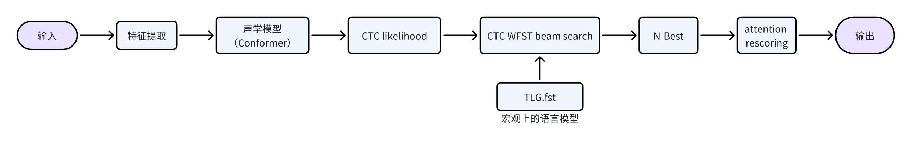
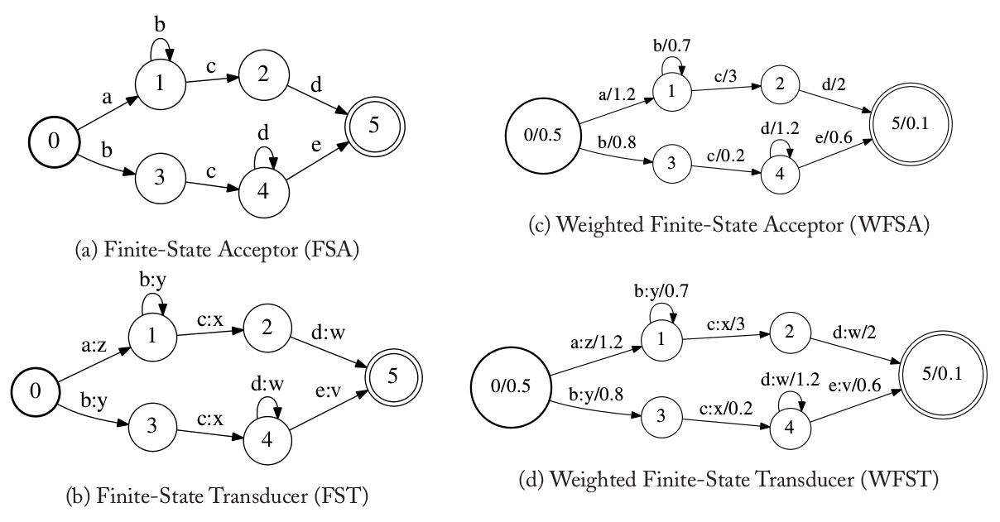
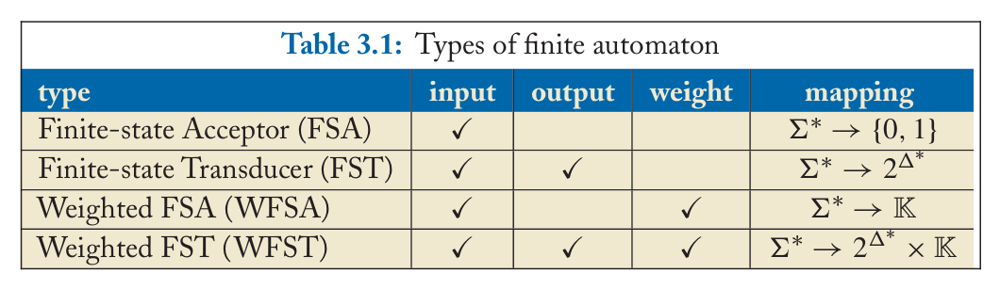
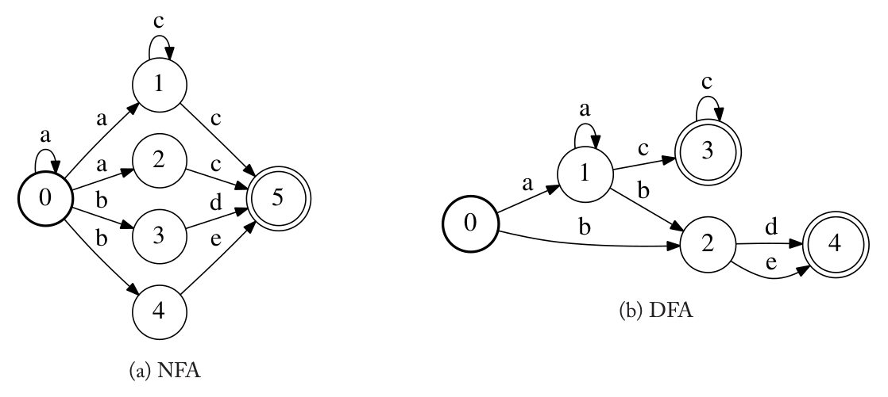
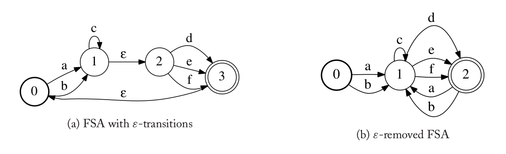
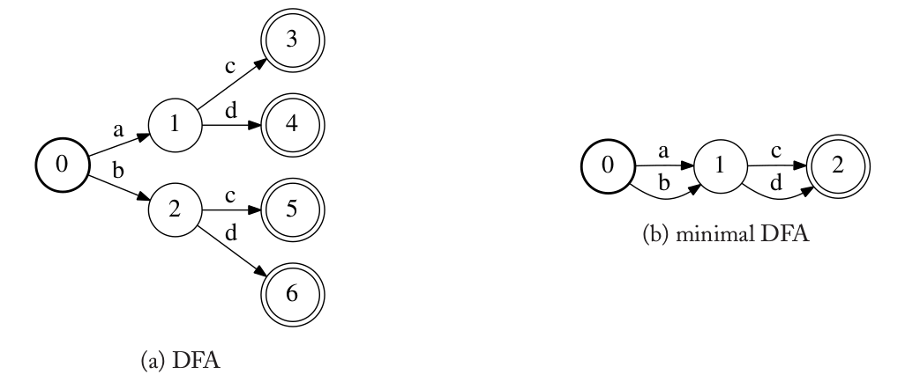
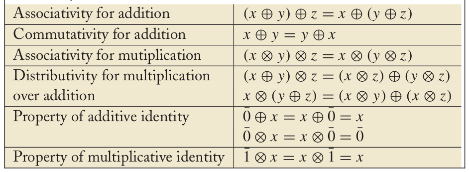
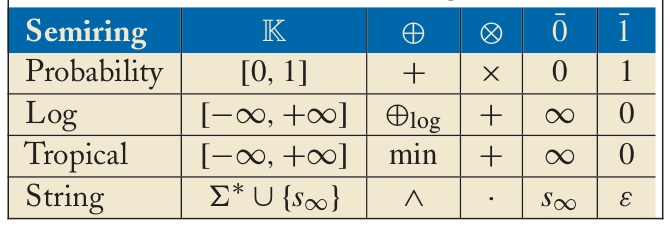

# 【语音识别】WFST基础知识（一）

语音识别系统包括：声学模型+语言模型。语言模型包括：统计语言模型 和 基于神经网络的语言模型。后者是端到端时代逐渐流行，但是在实际生产中，统计语言模型仍具有非常重要的作用，ngram语言模型是其中的代表。以wenet为例，其解码流程图如下：

    

wfst将语言模型和声学模型连接起来，最重要的是：该方法很容易进行badcase修复、热词增强、个性化解码。

> 本文会介绍wfst的理论基础，实操部分会在后续文章中介绍。

## 基础概念

WFST是一种有穷自动机(FA)。一个有穷自动机有一个有限的状态集合以及状态之间的跳转，其中每个跳转至少有一个标签(label)。

最基本的FA是有限状态接收机(finite state acceptor/FSA)。对于一个输入符号序列，FSA返回”接受”或者”不接受”，它的判断条件是：如果存在一条从初始状态到终止状态的路径，使得路径上的标签序列正好等于输入符号序列，那么就是”接受”，否则就是”不接受”。

> 约定：没有特殊说明，用加粗的圆圈表示初始状态，用两个圈表示终止状态。

    

图(a)是一个FSA的例子。图中的节点和边分布代表状态和状态之间的跳转。个FSA接受在符号序列”a,b,c,d”，但是不接受“a,b,d”。

FSA的几种扩展算法:

- 有限状态转录机(Finite-State Transducer/FST)：图b所示，描述了把一个输入符号序列转换为另一个输出符号的转换规则。
- 加权有限状态接收机(Weighted Finite-State Acceptor/WFSA)，图c所示，每个跳转除了输入符号还有一个weight，此外初始状态和终止状态也有对应的初始weight和终止weight，提供了一种比较不同路径的度量。
- 加权有限状态转录机(Weighted Finite-State Transducer/WFST)，图d所示，跳转上同时包括输出标签和weight，可以认为是FST和WFSA的组合。

> FST和WFST也称为转换机（transduce）
weight元素的集合 $\mathbb{K}$上的一个WFST由下面的8-tuple$(\Sigma, \Delta, Q, I, F, E, \lambda, \rho)$来定义：

- $\Sigma$ 是一个有限的输入符号集合
- $\Delta$ 是一个有限的输出符号集合
- $Q$ 是一个有限的状态集合
- $I \subseteq Q$ 是初始状态集合
- $F \subseteq Q$ 是终止状态集合
- $E \subseteq Q \times(\Sigma \cup \epsilon) \times(\Delta \cup \epsilon) \times \mathbb{K} \times Q$ 跳转的多重集合。
- $\lambda: I \rightarrow \mathbb{K}$ 是初始状态weight的函数
- $\rho: F \rightarrow \mathbb{K}$ 是终止状态weight的函数

ϵ是一个特殊的(输入和输出)符号，它代表空，没有输入/输出。上图(d)的WFST为：

- $\Sigma=\{a, b, c, d, e\}$
- $\Delta=\{v, x, y, w, z\}$
- $Q=\{0,1,2,3,4,5\}$
- $I=\{0\}$
- $F=\{5\}$
- $E=\{(0, \mathrm{a}, \mathrm{z}, 1.2,1),(0, \mathrm{~b}, \mathrm{y}, 0.8,3),(1, \mathrm{~b}, \mathrm{y}, 0.7,1),(1, \mathrm{c}, \mathrm{x}, 3,2),(2, \mathrm{~d}, \mathrm{w}, 2,5),(3, \mathrm{c}, \mathrm{x}, 0.2,4)$, $(4, \mathrm{~d}, \mathrm{w}, 1.2,4),(4, \mathrm{e}, \mathrm{v}, 0.6,5)\}$
- $\lambda(0)=0.5$
- $\rho(5)=0.1$

用下表来总结4种类型的FA。如上面提到过的，FSA的跳转上只有一个输入符号并且最终返回是否接受某个输入符号序列。在下表里，”function”表示这个FA表示的映射(mapping)。对于FSA来说，Σ∗里的一个输入符号序列被映射为二值0,1，其中0表示接受1表示拒绝。FST的跳转上同时有输入和输出符号，它表示的映射是一个函数 $f: \Sigma^{*} \rightarrow 2^{\Delta^{*}}$，这里 $2^{\Delta^{*}}$表示 $\Delta^{*}$的幂集。它表示FST可以把同一个输入字符串(符号序列)映射为多个(当然也包括零个)输出符号序列。WFSA的跳转上有一个weight，它表示的映射为 $f: \Sigma^* \rightarrow \mathbb{K}$，也就是把一个输入字符串映射为 $\mathbb{K}$里的一个元素(数)。而WFST是WFSA和FST的组合，它把一个输入字符串映射为一个集合，集合中的每个元素包括一个输出字符串和一个weight。

    

## FA的基础属性

FA的一个重要性质是它是确定的(deterministic)还是非确定的(non-deterministic)。一个确定的FA(DFA)只有一个初始状态，并且对于每个状态如果给定了一个输入符号，最多有一条边。

DFA的优点是给定输入符号序列，判断它是否被接受的计算是比较快的(相对于非确定的NFA来说)。可以使用二分查找。而NFA给定一个状态和一个输入符号，它可以有多条跳转的边。因此，我们需要考虑多种可能的路径。

不过存在一个算法把NFA转换成与之等价的DFA。这叫做确定化(determinization)算法

    

FA的另外一个重要属性就是它的输入标签里是否有特殊的ε。输入符号为ε的跳转叫做ε-跳转，这个状态的跳转不需要任何输入符号就可以进行，有ε-跳转的FSA是非确定的，我们把它叫做ε-NFA。

    

最后，给定一个FA，我们把所有与之等价的DFA组成的集合里状态数最小的DFA叫做最小DFA。最小DFA也可以用于检查不同的FA是否等价，因为两个FA通过消除ε跳转、确定化和最小化之后，如果它们是等价的，则经过上述3个操作之后得到的最小DFA是完全一样的(状态和跳转完全一样，当然可能是状态的命名不一样)。

    

## 半环

对于加权的(weighted)FA，weight以及其上的二元运算”加法”和”乘法”需要更加形式化的定义用于使得FA和相关的算法更加一般化。在理论上，weight和其上的运算是使用半环来定义的，这是一种抽象代数的代数结构。这意味着任何类型的weight都可以把FA的算法处理，当然前提是需要用这个weight的集合来定义一个半环。

半环类似于环(群、环、域是抽象代数的基本研究对象，计算机专业的读者可能学过的离散数学也会有部分介绍)，这是一种代数结构，但是半环并不像环那样要求加法逆元的存在。一个半环定义为 $(\mathbb{K}, \oplus, \otimes, \overline{0}, \overline{1})$，其中 $\mathbb{K}$是一个集合，⨁和⨂是$\mathbb{K}$上的两个二元运算，分别叫做”加法”和”乘法”。 $\overline{0}$和 $\overline{1}$是属于$\mathbb{K}$的两个特殊元素，分别叫做加法单位元和乘法单位元，因为它们和实数中的0和1有类似的性质，因此也叫零元和幺元。半环必须满足下表的性质。

    

下表是一些常见半环，其中 $x \oplus_{\log} y \equiv-\log \left(e^{-x}+e^{-y}\right)$。

    

基于WFST的语音识别系统中，Tropical （热带半环）是最常用的一个半环。 在一些WFST优化步骤中也会用到log半环。

以下是半环的一些性质：

- 交换的(commutative)

一个半环 $(\mathbb{K}, \bigoplus, \bigotimes, \overline{0}, \overline{1})$ 是交换的，则其"乘法"是遵循交换律，也就是:

$\forall x, y \in \mathbb{K}, x \bigotimes y=y \bigotimes x$

热带半环和log半环是交换的半环。

- 幂等的(idempotent)

一个半环 $(\mathbb{K}, \bigoplus, \bigotimes, \overline{0}, \overline{1})$ 是幂等的，则其"加法"满足:

$$x=x \bigoplus x$$

热带半环是幂等的，因为 $\min (x, x)=x$ 。但是 $\log$ 半环不是，因为 $x \neq x \bigoplus_{l o g} x$ 。

- k-closed

假设 $k \leq 0$ ，一个半环 $(\mathbb{K}, \bigoplus, \otimes, \overline{0}, \overline{1})$ 是 k -closed，则它满足：

$$\forall x \in \mathbb{K}, \bigoplus_{n=0}^{k+1} x^n=\bigoplus_{n=0}^k x^n$$

使用数学归纳法，还可以推广到所有的 $$l>k$$ 的情况:

$$\forall x \in \mathbb{K}, \bigoplus_{n=0}^l x^n=\bigoplus_{n=0}^k x^n$$

热带半环是0-closed，而log半环如果忽略很小的误差也可以认为是k-closed。

- weakly left-divisible

一个半环 $(\mathbb{K}, \bigoplus, \otimes, \overline{0}, \overline{1})$ 是weakly left-divisible，则其"加法"满足这样的性质：如果 $x \bigoplus y \neq \overline{0}$ ，则至少存在一个z使得 $x=(x \bigoplus y) \otimes z$ 。

热带半环和log半环都是weakly left-divisible的半环。

- zero-sum free

一个半环 $(\mathbb{K}, \bigoplus, \otimes, \overline{0}, \overline{1})$ 是zero-sum free的，则它满足：如果 $x \bigoplus y=\overline{0}$ ，则 $x=y=\overline{0}$ 。

## 总结

WFST是语音识别中语言模型的重要组成，虽然已经有神经网络的语言模型，但目前在实际业务中，基于WFST的语言模型仍占有重要的地位，因为它可以很方便的针对业务场景做优化。

本文主要介绍wfst的基础概念，后续文章会介绍WFST相关的基础运算，以及asr系统中如何使用wfst。
