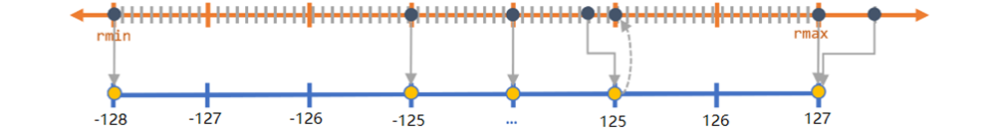
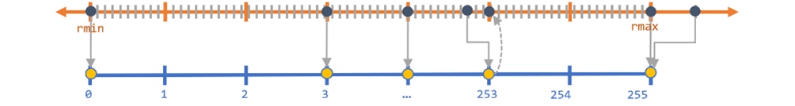

# 一文搞懂什么是量化（基础篇）

量化是个老生常谈的话题，从深度学习流行至今，生产环境中离不开量化，尤其是端侧部署，但仍是小众领域。进入大模型时代，量化逐渐被重视起来，其原因是：大模型巨大的参数量，对访存和算力有了更高的要求。机器不变的情况下，定点模型相比于浮点模型，占用的访存更小，且定点算力更高。

本文只介绍量化的基础知识，通俗易懂，不涉及复杂公式

## 1. 量化概念

### 1.1 什么是量化

**量化：将连续取值离散化成有限取值的过程。**

> 为了保证较高的精度，大部分的科学运算都是采用浮点型进行计算，常见的是32位和64位浮点型。
>
> 对于深度学习模型来说，乘加计算量是非常大的，往往需要GPU等专用的计算平台才能实现实时运算，这对于端上产品来说是不可接受的，而模型量化是一个有效降低计算量的方法。
>

模型量化，即将网络的权值，激活值等从高精度转化成低精度的操作过程，例如将32位浮点数转化成8位整型数int8，同时我们期望转换后的模型准确率与转化前相近。

### 1.2 模型量化的优势

模型量化可以带来几方面的优势，如下：

- 更小的模型尺寸。以8bit量化为例，与32bit浮点数相比，我们可以将模型的体积降低为原来的四分之一，这对于模型的存储和更新来说都更有优势。
- 更低的功耗。移动8bit数据与移动32bit浮点型数据相比，前者比后者高4倍的效率，而在一定程度上内存的使用量与功耗是成正比的。
- 更快的计算速度。相对于浮点数，大多数处理器都支持8bit数据的更快处理，如果是二值量化，则更有优势。

## 2. 大模型为什么做量化

1. Decode 阶段是严重带宽瓶颈（在端侧的单 batch 情况下更严重），需要减少访存来优化推理延迟
   - 在端侧 batch_size = 1 的情况下，参数访存占用最大，占比超过 90% ，最重要的是量化权重来减少参数访存
   - 在服务端长 batch 和长上下文的小模型情况下，KV cache 访存占比 80% 以上，重点是量化 KV cache 来减少访存
   - 在服务端大模型长 batch 和长上下文的大模型情况下，KV cache 访存占比和模型参数访存占比相当，需要同时量化权重和 KV cache 来减少访存
2. 计算平台 int8 的算力一般高于 fp16，为了提高 prefill 的速度，需要权重+激活值量化才能利用 int8 算力

## 3. 量化分类

- **按照量化阶段**，分为量化感知训练(Quant Aware Training, QAT) 和 训练后量化(Post Training Quantization, PTQ)
- **按照量化对象**，分为仅权重量化(weight-only) 和 权重和激活量化(weight and activation)
- **按照量化类型**，分为对称量化和非对称量化

### 3.1 QAT vs. PTQ

    

#### 3.1.1 PTQ训练后量化

  图左所示，在模型训练好以后，使用一批校准数据统计模型的激活值分布，再进行量化，无需对模型架构进行修改或进行重新训练，简单高效，但是带来一定的量化损失。

  PTQ又分为动态离线量化和静态离线量化。

  - 动态离线量化仅将模型中特定算子的权重从FP32类型映射成 INT8/16 类型，bias和激活函数 在推理过程中动态量化。但是对于不同的输入值来说，其缩放因子是动态计算的（“动态”的由来）。
  - 静态离线量化使用少量无标签校准数据，采用 KL 散度等方法计算缩放因子

静态量化与动态量化的区别在于其输入的缩放因子计算方法不同，静态量化的模型在使用前有“calibrate”的过程（校准缩放因子）

#### 3.1.2 QAT量化感知训练

图右所示，在训练期间模拟量化，通过将量化损失纳入模型的目标函数来保持模型性能。这种方法会降低训练速度，但是能够获得更高的精度。

> 大多数情况下，量化方法优先选择无需训练的PTQ，PTQ不满足精度的情况下再考虑QAT。

### 3.2 Weight-only vs. Weight and Activation
模型前向计算过程中，包含两部分参数：

  1. 权重：训练完后固定，数值范围(range)与输入无关，可离线完成量化，通常相对容易量化；
  2. 激活值：激活输出随输入变化而变化，需要统计数据动态范围，通常更难量化。

根据量化的对象，可以将模型量化分为两种类型：
  1. 仅权重量化（weight-only），相对简单、量化损失较小，适用于浮点算力充足的情况
  2. 权重-激活值量化（weight-activation），相对复杂，量化损失较大，但是能够加速计算、减少访存量，适用于浮点算力较少、定点算力充足的端侧

#### 3.2.1 weight-only量化

##### 3.2.1.1 定义

提前将某些op的权重量化为INT8/INT4等更低比特的类型，然后在模型推理时反量化为浮点数，再参与计算

    

- 需要芯片支持浮点计算单元
- 适合英伟达等浮点算力较强的芯片
- 提前计算好scale，静态量化

##### 3.2.1.2 分类
根据weight量化的粒度，可以分为per_tensor、per_channel、per_block。假设Linear层的输入为 $[ B, T, D_{in}]$，权重为$ [ D_{out}, D_{in}]$，输出为 $[ B, T, D_{out}]$ （$Y=XW^T$），三种量化的情况如下图所示：

    

  1. per-tensor：整个tensor取绝对值的最大值来计算scale，每个元素使用同一个scale量化
  2. per-channel：tensor在$D_{out}$的维度上划分为$D_{out}$个channel，各自取绝对值的最大值来计算scale，每个channel使用同一个scale量化
  3. per-block：在per-channel的基础上，每个channel划分为$\frac{D_{in}}{block\_size}$个block，每个block使用同一个scale量化

#### 3.2.2 weight-activation量化

##### 3.2.2.1 定义

提前量化权重，同时在模型推理时，将某个op的输入进行量化，该op进行定点计算。

    

假设输入X的数值范围是act_range，那么int8量化的$scale=\frac{max(abs(act\_range))}{127.0}$

  1. 静态量化：提前使用标定数据做forward，估算act_range
  2. 动态量化：模型推理时，直接使用输入X的act_range

##### 3.2.2.2 分类

根据激活值的量化粒度，可以分为per_tensor、per_token、per_channel、per_block四种量化方式。

    

  1. per-tensor：整个tensor取绝对值的最大值来计算scale，每个元素使用同一个scale量化
  2. per-channel：激活值tensor在$D_{in}$的维度上划分为$D_{in}$个channel，各自取绝对值的最大值来计算scale，每个channel使用同一个scale量化
  3. per-token：激活值tensor在$T$（序列长度）的维度上划分为$T$个channel，各自取绝对值的最大值来计算scale，每个channel使用同一个scale量化
  4. per-block：在vector-wise的基础上，每个vector划分为$\frac{D_{in}}{block\_size}$个block，每个block使用同一个scale量化

在decode阶段，使用kv cache存储历史key和value，每次将上一个解码的token输入到模型中进行forward propaganda，每一层的输入序列长度为1，因此per-token和per-tensor的量化方式等价：

    

### 3.3 对称量化 vs. 非对称量化

下面两个公式表述了如何做量化和反量化，其中$scale$和$z$是量化的参数。对称量化就是把$z$设置为0，非对称量化就是找一个合适的$z$，使得量化损失更小。

$$Q(x)=round((x-z)/scale)$$
$$D(Q(x))=Q(X)\times{scale}+z$$

**以8bit量化为例**：

- 对称量化

    

对称算法是通过一个收缩因子，将FP32中的最大绝对值映射到8比特的最大值，最大绝对值的负值映射到8比特的最小值

$$scale = \max (abs(rmax), abs(rmin)) / 128$$

fp32的值若均匀分布在0左右，映射后的值也会均匀分布，若fp32的值分布不均匀，映射后不能充分利用，会有较大损失。

- 非对称量化

    

通过收缩因子和零点（用于偏移），将 FP32 张量 的 min/max 映射分别映射到 8-bit 数据的 min/max 。

$$scale = (rmax - rmin) / 255$$

加入零点的原因：0有特殊意义如padding，若不加零点z，量化后会映射到0，加入零点z后，浮点0量化后映射到0-255中间的一个数字。可以无误差地量化浮点数中的数据 0，从而减少补零操作（比如卷积中的padding zero）在量化中产生额外的误差。

缺点是只有正数，有的处理方式是把0点左移到-128，范围控制在[-128，127]中，但还是非对称量化。

