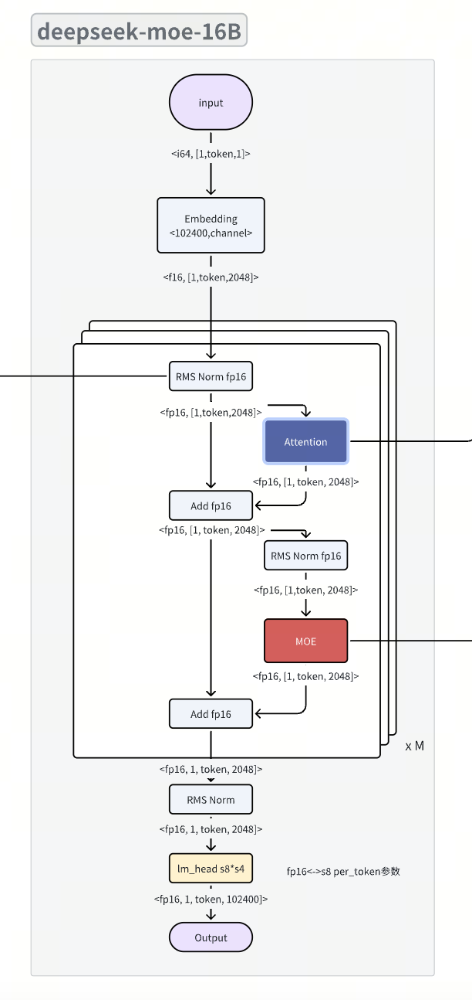
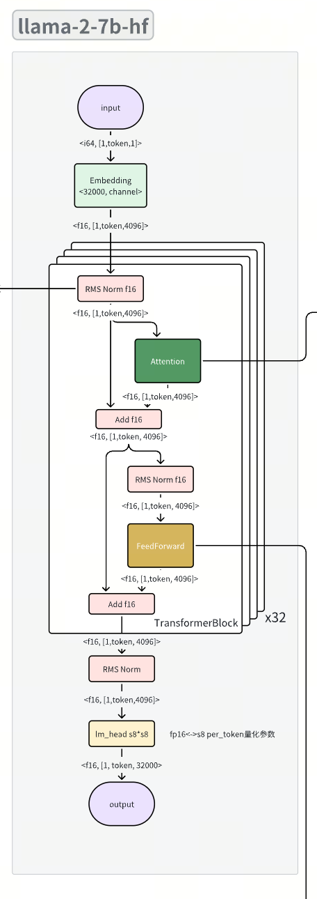
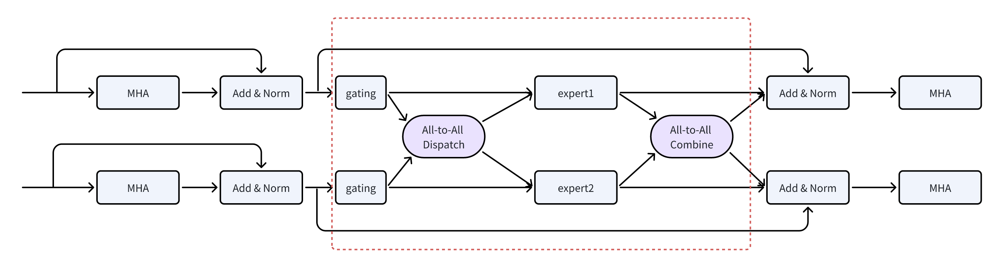

# MOE介绍

> 本文导读：
> - 介绍moe的基本概念，moe模型对LLM的作用
> - moe量化实验
> - CPU/GPU上推理测试
> - 以tensorrt-llm为例，分析MoE kernel的实现


## MoE概念
Sparse MoE是大模型时代主流的MoE结构，一般听到的xx-moe LLM模型，都是使用Sparse MoE，那为什么需要Sparse MoE?
SparseMoE 结构：只需取topK的gating_weights值对应的expert来计算，最终再把各个expert结果给reduce起来，此时只需要计算少数的expert。

<center>
    
</center>


原因：
1. gaiting_weights 中有很多值非常小，接近0。本质上可以等效为一个稀疏化
2. Sparse MoE模型中，实际激活参数很少，能加速训练和推理。Mixtral-8x7B实际只需2个7b模型即13b参数参与计算，但就可比肩LLama2-70b和GPT3.5的任务表现.


**下文的sparse moe简写为moe**

## 代表模型

### 商用模型

|   公司   |   模型   | 发布时间 |             |        |
|:--------:|:--------:|:--------:|:-----------:|:------:|
|  OpenAI  |   GPT-4  |  23.3.14 |             | 多模态 |
| 昆仑万维 |  天工2.0 |  24.2.6  |  千亿级参数 | 多模态 |
|          |  天工3.0 |  24.4.17 | 4千亿级参数 | 多模态 |
|  MiniMax |  abab 6  |  24.1.23 |   千亿参数  |  单模  |
|          | abab 6.5 |  24.4.17 |   万亿参数  |  单模  |
| 阶跃星辰 |  Step-2  |  24.3.23 |   万亿参数  |  单模  |

### 开源模型

| 单/多模 |                       | 等效模型    | 总专家 | 激活专家      |                                                             |
|---------|-----------------------|-------------|--------|---------------|-------------------------------------------------------------|
| 单模    | Mixtral 8x7B          | llama2-70B  | 8      | 2             | https://huggingface.co/mistralai/Mixtral-8x7B-Instruct-v0.1 |
|         | deepseek-moe-16B      | llama2-7B   | 64 + 2 | 6 + 2(shared) | https://huggingface.co/deepseek-ai/deepseek-moe-16b-chat    |
|         | Qwen1.5-moe-14B       | qwen1.5-7B  | 60 + 4 | 4 + 4(shared) | https://huggingface.co/Qwen/Qwen1.5-MoE-A2.7B-Chat          |
|         | LLaMA-MoE-3.5B (2/8)  | -           | 8      | 2             | https://github.com/pjlab-sys4nlp/llama-moe                  |
|         | XVERSE-MoE-A4.2B      | qwen1.5-7B  | 64+2   | 6+2           | https://huggingface.co/xverse/XVERSE-MoE-A4.2B              |
| 多模    | MoE-LLaVA-1.6B×4-Top2 | llava1.5-7B | 4      | 2             | https://github.com/PKU-YuanGroup/MoE-LLaVA                  |
|         | MoE-LLaVA-1.8B×4-Top2 |             | 4      | 2             |                                                             |
|         | MoE-LLaVA-2.7B×4-Top2 |             | 4      | 2             |                                                             |

## 模型结构

llama-7B 和 deepseek-moe-16B的对比
<center class="half">
    
    
</center>

如上图，deepseek-moe-16B相比于llama2-7B的不同点：
- 将FFN层替换为MOE
- hidden_size由4096降低为2048

<center class="half">
    
    
</center>

MOE中每个专家就是一个FFN，输入通过gating+softmax+topk，会得到每个token所选的专家id，然后将token传给对应的专家进行计算，最后对专家的输出做加权求和

## Deepseek-moe-16B 模型 参数/计算量分析

|                      |            | deepseek-moe-16B | llama-2-7B |
|:--------------------:|:----------:|:----------------:|:----------:|
|                      |   参数量   |       16.4B      |    6.9B    |
|                      | 激活参数量 |       2.8B       |    6.9B    |
| KV cache size = 2048 | 预估计算量 |      3.992G      |   11.140G  |
|                      | 预估访存量 |      2.231G      |   6.107G   |

根据理论分析，deepseek-moe-16相比于llama-2-7B预期有两倍提速。

## 实验
### 量化实验
以deepseek-moe-16B(https://huggingface.co/deepseek-ai/deepseek-moe-16b-chat)为例：

量化类型：weight per-channel, activate per-token

|                  | 量化类型 | inner_100 |          | common_100 |          |
|:----------------:|:--------:|:---------:|:--------:|:----------:|:--------:|
|                  |          |    PPL    | 量化损失 |     PPL    | 量化损失 |
|    llama-2-7B    |   fp16   |  7.7647   |     -    |   8.1515   |     -    |
|                  |   w4a8   |  7.6498   |  68.63%  |  21.5235   |  104.52% |
|                  |   w4a16  |  7.0441   |  55.27%  |  19.3920   |  84.26%  |
| deepseek-moe-16B |   fp16   |  7.7647   |     -    |   8.1515   |     -    |
|                  |   w4a8   |  8.4019   |   8.21%  |   9.5770   |  17.49%  |
|                  |   w4a16  |  8.2348   |   6.05%  |   9.2556   |  13.54%  |

结论：deepseek-moe-16B的量化损失更小。

### 推理测试
#### llama.cpp CPU 速度实测
> CPU测试：
>
> dev050 CPU： Intel(R) Xeon(R) Silver 4214R CPU @ 2.40GHz
>
> CPU实测结果：deepseek-moe-16B推理速度是llama-2-7B的两倍

|                                                  |                    |  fp16(ggml)  |              |  q8_0(ggml)  |              |  q4_0(ggml)  |              |
|:------------------------------------------------:|:------------------:|:------------:|:------------:|:------------:|:------------:|:------------:|:------------:|
|                                                  |                    |   Prefill    |    decode    |    prefill   |    decode    |    prefill   |    decode    |
| deepseek-moe-16B prompt_len=128 generate_len=128 |     model size     |      31G     |              |      17G     |              |     8.7G     |              |
|                                                  | token/s (2 thread) |  5.34 ± 0.10 |  2.64 ± 0.01 |  7.91 ± 0.03 |  4.18 ± 0.05 |  6.30 ± 0.04 |  4.74 ± 0.05 |
|                                                  | token/s (4 thread) | 10.50 ± 0.07 |  3.84 ± 0.04 | 14.75 ± 0.18 |  6.24 ± 0.11 | 12.15 ± 0.18 |  7.64 ± 0.11 |
|                                                  | token/s (8 thread) | 19.37 ± 0.22 |  4.12 ± 0.05 | 26.42 ± 1.07 |  6.83 ± 0.21 | 20.77 ± 0.64 | 10.04 ± 0.15 |
|                                                  |                    |              |              |              |              |              |              |
|   llama-2-7B prompt_len = 128 generate_len=128   |        size        |      13G     |              |     6.7G     |              |     3.6G     |              |
|                                                  | token/s (2 thread) |  2.08 ± 0.01 |  1.12 ± 0.04 |  3.25 ± 0.01 |  1.92 ± 0.03 |  2.59 ± 0.04 |  2.14 ± 0.02 |
|                                                  | token/s (4 thread) |  4.08 ± 0.03 |  1.63 ± 0.02 |  6.27 ± 0.11 |  2.85 ± 0.01 |  5.07 ± 0.07 |  3.83 ± 0.04 |
|                                                  | token/s (8 thread) |  7.74 ± 0.10 |  1.77 ± 0.02 | 11.54 ± 0.20 |  3.16 ± 0.06 |  9.60 ± 0.16 |  5.33 ± 0.08 |


#### vllm GPU 速度实测
> GPU: 3090 * 2
>
> CPU：Intel(R) Xeon(R) Silver 4214R CPU @ 2.40GHz
>
> 测试结论：
>
> - Prefill: 随着prompt_len长度的提升，加速比随之提升。当prompt_len=1024，有2倍的提升
>
> - Decode: deepseek-moe-16B模型相比于llama2-7B模型有1.5倍的解码速度提升

|                  |           |  prompt_len. + gen_len | 1st token latency (prefill) ms | prefill token/s | decode tokens/s |
|:----------------:|:---------:|:----------------------:|:------------------------------:|:---------------:|:---------------:|
|     LLama 7B     | FP16 1GPU |        128 + 128       |             33.829             |     3783.738    |      53.833     |
|                  |           |       1024 + 1024      |             223.175            |     4588.324    |      51.228     |
|                  | FP16 2GPU |        64 + 128        |             34.801             |     1839.033    |      74.273     |
|                  |           |        128 + 128       |             35.343             |     3621.628    |      73.256     |
|                  |           |        512 + 512       |             107.367            |     4768.699    |      71.646     |
|                  |           |       1024 + 1024      |             197.839            |     5175.907    |      70.059     |
| deepseek-moe-16B | FP16 2GPU |        64 + 128        |             46.869             |     1365.508    |     114.230     |
|                  |           |        128 + 128       |             56.247             |     2275.677    |     113.820     |
|                  |           |        512 + 512       |             58.898             |     8692.995    |     111.213     |
|                  |           |       1024 + 1024      |             92.809             |    11033.413    |     110.2485    |


#### tensorrt-llm GPU 速度实测
*笔者基于0.9.0版本适配的deepseek-moe-16B模型*

> GPU: 3090 * 2
>
> CPU：Intel(R) Xeon(R) Silver 4214R CPU @ 2.40GHz
>
> 结论：
>   - Prefill: 随着prompt_len长度的提升，加速比随之提升。当prompt_len=1024，有1.6倍的提升
>   - Decode: deepseek-moe-16B模型相比于llama2-7B模型有1.5倍的解码速度提升

|                  |           |  prompt_len. + gen_len | 1st token latency (prefill) ms | prefill token/s | decode tokens/s |
|:----------------:|:---------:|:----------------------:|:------------------------------:|:---------------:|:---------------:|
|     LLama 7B     | FP16 1GPU |        128 + 128       |             36.766             |     3481.477    |      53.246     |
|                  |           |       1024 + 1024      |             223.696            |     4577.641    |      51.661     |
|                  | FP16 2GPU |        64 + 128        |             44.182             |     1448.554    |      96.611     |
|                  |           |        128 + 128       |             55.755             |     2295.758    |      96.57      |
|                  |           |        512 + 512       |             117.322            |     4364.058    |      94.662     |
|                  |           |       1024 + 1024      |             217.973            |     4697.830    |      92.676     |
| deepseek-moe-16B | FP16 2GPU |        64 + 128        |             48.086             |     1330.949    |     147.649     |
|                  |           |        128 + 128       |              53.83             |     2377.856    |     149.091     |
|                  |           |        512 + 512       |             97.036             |     5276.392    |     145.506     |
|                  |           |       1024 + 1024      |             133.104            |     7693.232    |     141.659     |


> 问题：GPU速度没达到预期（2倍），为此调研现在主流的gpu部署框架：vllm / tensorrt-llm，本文以tensorrt-llm为主进行分析，vllm的实现和tensorrt类似


## cuda kernel实现
梳理cuda kernel实现前，先了解下pytorch的实现

**MoE layer forward**
```bash
# https://github.com/wenet-e2e/wenet/blob/main/wenet/transformer/positionwise_feed_forward.py#L97
def forward(self, xs: torch.Tensor) -> torch.Tensor:
    """Foward function.
    Args:
        xs: input tensor (B, L, D)
    Returns:
        output tensor, (B, L, D)

    """
    B, L, D = xs.size(
    )  # batch size, sequence length, embedding dimension (idim)
    xs = xs.view(-1, D)  # (B*L, D)
    # 1. gate，选专家模型
    router = self.gate(xs)  # (B*L, n_expert)
    logits, selected_experts = torch.topk(
        router, self.n_expert_activated
    )  # probs:(B*L, n_expert_activated), selected_exp: (B*L, n_expert_activated)
    weights = torch.nn.functional.softmax(
        logits, dim=1,
        dtype=torch.float).to(dtype=xs.dtype)  # (B*L, n_expert_activated)
    output = torch.zeros_like(xs)  # (B*L, D)
    # 2. 循环专家，每个专家只计算分配的token
    for i, expert in enumerate(self.experts):
        mask = selected_experts == i
        token_ids, ith_expert = torch.where(mask)
        output[token_ids] += weights[token_ids, ith_expert, None] * expert(
            xs[token_ids])
    return output.view(B, L, D)
```

<center>
    
</center>

如上图。对应于上面代码，每个expert都去找自己要处理的token，比如expert1找到token0和token1，expert2找到token2....expert5找到token1，然后各个expert与对应的token hidden states做FFN，得到该token上的中间hidden states，最终做一个加权reduce sum（代码里面是index_add）

> 理清了以上pytorch实现之后，问题来了：上述代码是for循环执行各个expert与对应token的FFN，最后各个token再累加自身的中间hidden states，本质上是一个串行操作。那么如何用CUDA并行实现呢？

### Tensorrt-llm moe kernel
tensorRT-LLM对于这块的代码位于[moe_kernels.cu](https://github.com/NVIDIA/TensorRT-LLM/blob/main/cpp/tensorrt_llm/kernels/mixtureOfExperts/moe_kernels.cu)，MoElayer的run函数位于923行，流程与普通kernel无异:

- 分配buffer或者workspace
- 预防性check
- launch一系列kernel
  - gating(linear+softmax+topK）
  - **expert !!!**

<center>
    
</center>

难点就在于expert这里如何并行起来，本文单针对计算逻辑来讲。(https://arxiv.org/abs/2211.15841)

tensorRT-LLM采用了一种非常直接的方法:  既然每个expert都是对某几个token做FFN，针对里面的GEMM，那我让各个expert做的GEMM都merge成一个batch，然后做batch GEMM，batch size的大小等于expert的个数，只需要按照expert的顺序复制以及重排各个token row,  并且再记录各个token row对应的原始位置，最后experts做batch GEMM完成之后根据此记录恢复原始的顺序，再加权reduce sum即可得到每个token的hidden states。

**注意**：tensorRT-LLM可以merge成一个batch GEMM的前提，就是要做padding，使得每一个expert都匹配一个相同shape的weight矩阵，以及分配给每个expert的token数量要一样

相对耗时的点：
1. 涉及到两次对齐：
  - 对输入token做排序
  - 对输出的结果做还原
2. padding。当batch很大的时候，从统计角度来看，每个专家的分配的token数会接近均衡，这样少了很多padding，节省计算，提高吞吐量。当batch很小的时候，每个专家负载不均衡，会有大量的padding。

<center>
    
</center>

**注意**：当batchsize=1, decode阶段，是不需要padding的。tensorrt中只把需要的专家挑选出来

Batch GEMM(也称为Group GEMM)可以使用cutlass中提供的标准函数。(面向GitHub编程经验告诉我们，不要轻易挑战标准库的性能，尽量复用，站在巨人的肩膀上)

Batch GEMM: (E, m, k) * (E, k, n) → (E, m, n)


### vllm moe kernel
核心算子是fused_moe() （当num_token>1, 就是prefill阶段；当num_token=1, decode阶段）。

<center>
    
</center>

从流程来看，和tensorrt-llm是类似的，其中moe_align_block_size的作用是整理相应的token内存和weight内存排布，使其可以进行group Gemm kernel, 加速运算。
不同点：tensorrt-llm底层使用cutlass实现的group Gemm kernel，vllm使用openai triton实现。

### MoE分布式并行策略
https://arxiv.org/pdf/2006.16668.pdf

Dense模型使用Tensor Parallelism（TP），Data Parallelism（DP）还有Pipeline Parallelism（PP)。对MoE增加了Expert Parallelism（EP）。
Expert parallelism把专家分配到不同的计算资源上。比如，一个专家分配1个GPU。如有下特点：
1. 如果每个专家的tokens数目不同，则EP中不同GPU的计算负载不同。
2. 在MoE层和MHA前后衔接地方需要额外通信操作：MHA如果使用DP，转化成MoE的EP需要all-to-all操作，E * (B, S) → (EB, S_i),…, (EB, S_e)，MoE算完也需要all-to-all操作。EP可以和TP和DP混合使用。

<center>
    
</center>

代表性大模型推理框架对moe支持对比：

| 框架                    | 支持现状                 |                                                        |
|-------------------------|--------------------------|--------------------------------------------------------|
| tensorrt-llm nvidia     | Group GEMM + EP          | 从fast-transfomer演化而来，底层用cutlass实现group GEMM |
| vllm                    | Group GEMM + EP          | 底层用openai triton实现kernel                          |
| Fast transformer nvidia | 同tensorrt-llm           |                                                        |
| rtp-llm 阿里            | 底层使用fast-transformer |                                                        |


### MoE GPU效率没有CPU高的可能原因
- 单GPU，涉及到两次对齐：
  - 对输入token做排序
  - 对输出的结果做还原
- 多GPU，在MoE层和MHA前后衔接地方需要额外通信操作, 需要all-to-all操作
回到上文vllm GPU测试结果不符合预期的问题：
1. vllm上测试是单机多卡，存在all-to-all的耗时
2. 测试的模型是deepseek-moe-16，总计有64个专家，每张GPU上分配32个专家，对于这32个专家，也会存在单卡上组batch GEMM时存在的耗时问题。


## 总结

- 本文首先介绍moe的基本概念和结构
- moe相比于dense模型有更小的量化损失
- CPU上deepseek-moe16B相比于llama7B模型有两倍提速，GPU上有～1.5倍的提速
- 以tensorrt-llm为例，分析MoE kernel的实现，GPU上提速没有CPU上大的可能原因：
  - 如果是单GPU，专家权重和输入token对齐的过程会存在耗时
  - 如果是多GPU，在MoE层和MHA前后衔接地方需要额外通信操作, 需要all-to-all操作
