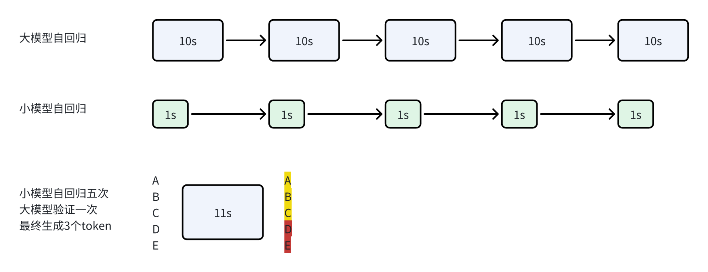
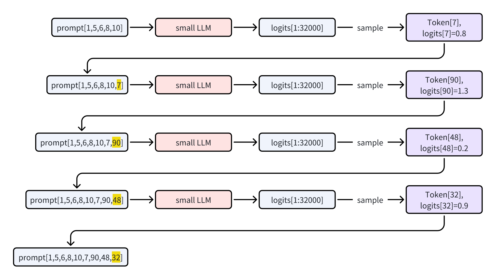
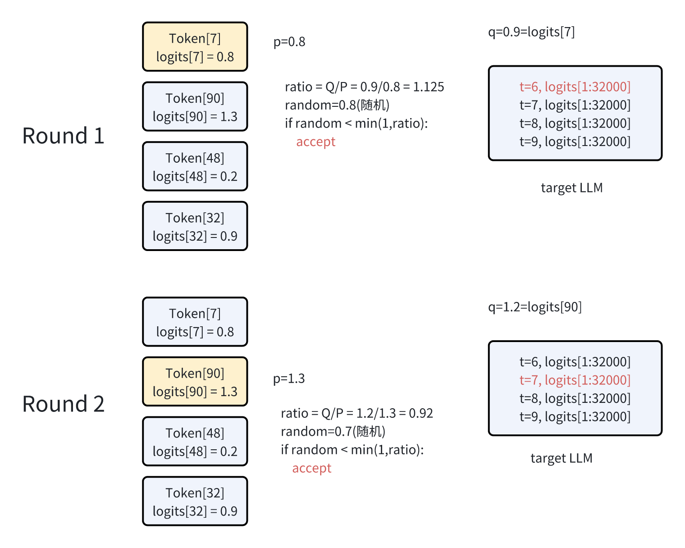
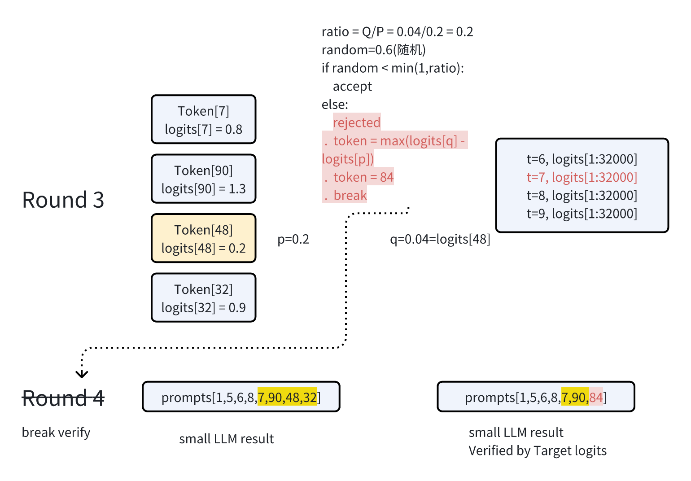
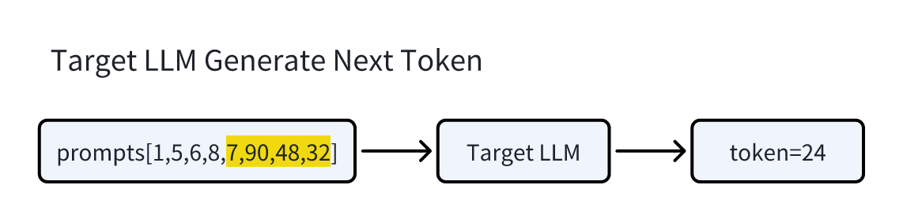

# [投机采样系列一] Speculative Decoding试图打破大模型自回归解码魔咒

> 本文导读：
>
> - 介绍speculative decoding相关的背景知识
>
> - 介绍两种典型的算法：Speculative sampling (independent drafting) 和 Medusa (self-drafting)
>
> 此文章面向LLM推理加速领域，试图突破传统next-token逐个推理耗时瓶颈 ，阅读此文前，需要熟悉LLM Decoder解码过程和KV Cache

## 背景介绍
大型语言模型推理通常使用自回归解码方法，decode阶段逐token带来严重的访存瓶颈。Speculative decoding是一种减少内存访问的方法，它能够保证生成性能不下降的情况下，提升推理速度。

> 综述：https://arxiv.org/pdf/2401.07851.pdf

speculative decoding算法范式：
1. Draft：使用Draft model 生成候选token序列（K个）
2. Verify: 将候选token序列输入到LLM（Target model）中进行打分验证
3. Accept: 从已打分的候选序列中挑选接受的序列

    

下图以一个简单的示例，说明投机采样带来的速度提升。如图所示，大模型常规生成3个token，需要30s，而投机解码只需要1s * 5 + 11s = 16s。

    

根据是否需要draft模型，投机采样可以分为independent-drafting ，self-drafting两类：

|      | 类型                 | 模型             | 链接                                                                                                 |
|------|----------------------|------------------|------------------------------------------------------------------------------------------------------|
| 高通 | Speculative sampling | 0.7B + 7B llama2 | https://www.qualcomm.com/content/dam/qcomm-martech/dm-assets/documents/Generative-AI-at-the-edge.pdf |
| 阿里 | Speculative sampling | 1.8B + 14B qwen  | https://mp.weixin.qq.com/s/M6bisR_rTHM-vyeOD9ILXA                                                    |

> 本文会介绍最朴素的投机采样算法 (Speculative sampling)，medusa 和 eagle算法会在后面更新。

## Speculative sampling
> 论文：https://arxiv.org/pdf/2302.01318.pdf https://arxiv.org/pdf/2211.17192.pdf
>
> 第三方实现：https://github.com/feifeibear/LLMSpeculativeSampling
>
> 加速比：1.9× ∼ 2.5×
>
> 注意：Speculative Sampling保证采样的概率分布一样，不是和auto-regressive sampling运行的输出完全一样。

### 原理
- draft：使用小模型，自回归预测n个token，得到一个候选序列
- Verify: 使用target LLM，对候选序列打分
- Accept：根据大模型和小模型的输出，得到最终序列

    

如图所示，每一行代表一次迭代，绿色的标记是由近似模型(小模型)生成的token，而目标模型(大模型)判断是否接受了这些token。红色和蓝色的标记分别表示被拒绝和其修正。

### 解码过程

    

上图是算法流程，本节会以图的形式，来逐步解释算法的解码过程。

1. 小模型逐步生成候选token

    

2. 目标大模型验证

    

3. 接受token：大模型根据token对应的logits与小模型输出对比

    

4. 拒绝token

    

5. 如果全接受，增加一次采样，得到新token

    

> 为什么和自回归采样等价?
>
> 论文附录中严格证明了对于任意分布p(x)和q(x)，通过从p(x)和q(x)进行投机采样所得到的标记的分布与仅从p(x)进行采样所得到的标记的分布是相同的。【证明过程较长，在此不展开】
>
> 通俗解释：p(x^') > q(x’) 说明大模型在token x’上概率大于小模型，则大模型对生成token x’更有把握，说明小模型生成的问题不大可以保留x’。如果p(x’) ≤ q(x’)则小模型更有把握，大模型就以1-p(x)/q(x)为概率概率拒绝，并重新采样。因为接收的概率更偏向q(x)大的位置，重新采样的概率应该更偏向p(x)大的位置，所以是norm(max(0, p(x)-q(x)))。

### 小模型选择
至此我们已经清楚Speculative sampling的计算流程，但这里的小模型可不是随意选取的:

- 小模型输出分布能够近似大模型，才能生成高accept rate的采样，推理才能更快
- 小模型通常由大模型进行蒸馏(knowledge Distillation)得来
> 对于speculative sampling，以为是在玩并行解码技巧，实质是要求做出高质量的模型压缩工作，才能有较高的accept rate
>
> 后续的medua以及eagle，也再次说明了高接受率带来的高收益

### 实验
> 使用qwen1.5-7B + qwen1.5+0.5B的开源模型【模型未经过蒸馏】
>
> 代码使用llama.cpp

|      | 类型                 | 模型             | 链接                                                                                                 |
|------|----------------------|------------------|------------------------------------------------------------------------------------------------------|
| 高通 | Speculative sampling | 0.7B + 7B llama2 | https://www.qualcomm.com/content/dam/qcomm-martech/dm-assets/documents/Generative-AI-at-the-edge.pdf |
| 阿里 | Speculative sampling | 1.8B + 14B qwen  | https://mp.weixin.qq.com/s/M6bisR_rTHM-vyeOD9ILXA                                                    |

实测结果加速比没有达到预期，因为接受率太低，如果要有2X的加速，接受比尽量要在75%以上，越高越好。

其他公开的结果也说明了以上的结论(ref https://github.com/ggerganov/llama.cpp/pull/2926)

## 参考
1. https://zhuanlan.zhihu.com/p/671432448
2. https://zhuanlan.zhihu.com/p/685282553
3. https://zhuanlan.zhihu.com/p/651359908
4. https://zhuanlan.zhihu.com/p/678404136
5. https://github.com/ggerganov/llama.cpp
6. https://huggingface.co/Qwen

